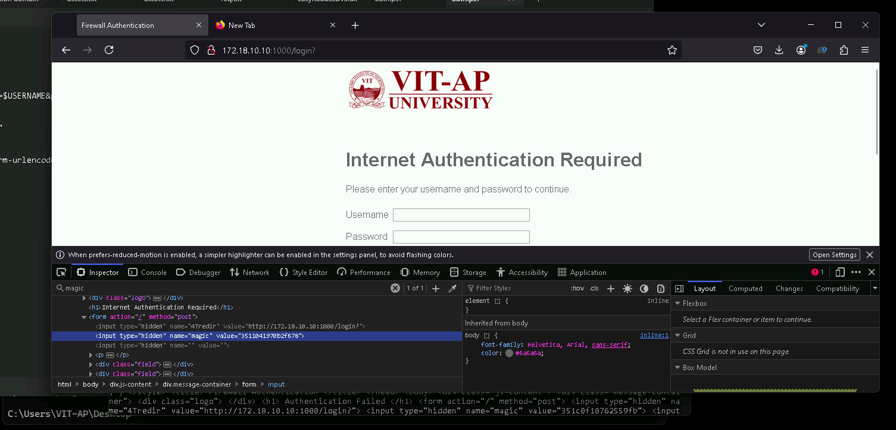
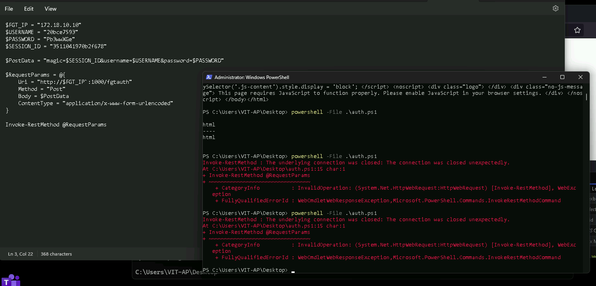
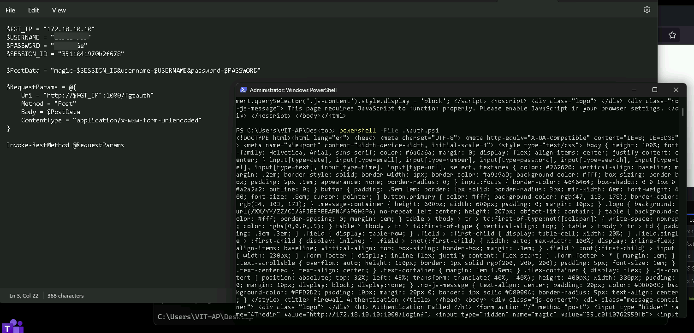

### captive-control
This the repository maintained for fortinet captive port auto login to university/organisation intranet 

for this i made golang wails cross platform desktop application checkout [wails desktop](captive-control/README.md)

### Fortinet FortiAP Captive Portal Auth - POC

login Script 

Execution Policy Set 
```powershell 
Set-ExecutionPolicy -ExecutionPolicy RemoteSigned -Scope CurrentUser
powershell -File auth.ps1
```
`auth.ps1` Script 

```powershell
$FGT_IP = "172.18.10.10"
$USERNAME = "xxxxxx"
$PASSWORD = "xxxxxx"
$SESSION_ID = "3511041970b2f678"

$PostData = "magic=$SESSION_ID&username=$USERNAME&password=$PASSWORD"

$RequestParams = @{
    Uri = "http://$FGT_IP`:1000/fgtauth"
    Method = "Post"
    Body = $PostData
    ContentType = "application/x-www-form-urlencoded"
}

Invoke-RestMethod @RequestParams
```

logout script 

```bash
curl 'http://172.18.10.10:1000/logout?' -H 'User-Agent: Mozilla/5.0 (Windows NT 10.0; Win64; x64; rv:129.0) Gecko/20100101 Firefox/129.0' -H 'Accept: text/html,application/xhtml+xml,application/xml;q=0.9,image/avif,image/webp,image/png,image/svg+xml,*/*;q=0.8' -H 'Accept-Language: en-US,en;q=0.5' -H 'Accept-Encoding: gzip, deflate' -H 'Connection: keep-alive' -H 'Upgrade-Insecure-Requests: 1' -H 'Priority: u=0, i'
```

```powershell
Invoke-WebRequest -UseBasicParsing -Uri "http://172.18.10.10:1000/logout?" `
-UserAgent "Mozilla/5.0 (Windows NT 10.0; Win64; x64; rv:129.0) Gecko/20100101 Firefox/129.0" `
-Headers @{
"Accept" = "text/html,application/xhtml+xml,application/xml;q=0.9,image/avif,image/webp,image/png,image/svg+xml,*/*;q=0.8"
  "Accept-Language" = "en-US,en;q=0.5"
  "Accept-Encoding" = "gzip, deflate"
  "Upgrade-Insecure-Requests" = "1"
  "Priority" = "u=0, i"
}
```

Windows POSIX CurRL
```powershell
curl 'http://172.18.10.10:1000/logout?' -H 'User-Agent: Mozilla/5.0 (Windows NT 10.0; Win64; x64; rv:129.0) Gecko/20100101 Firefox/129.0' -H 'Accept: text/html,application/xhtml+xml,application/xml;q=0.9,image/avif,image/webp,image/png,image/svg+xml,*/*;q=0.8' -H 'Accept-Language: en-US,en;q=0.5' -H 'Accept-Encoding: gzip, deflate' -H 'Connection: keep-alive' -H 'Upgrade-Insecure-Requests: 1' -H 'Priority: u=0, i'

```
- magic (session id) generation from FortiAP captive portal  


- Upon Successful Auth with Fortinet FortiAP Endpoint got as `200` status code response ie.. with certain magic generated from endpoint
- Observation : if we use the session again with the same magic you'll `444` status code    

- if the user the user logged w.r.t to FortiAP server side session will session will get generated with prior MAC address from host `NIC` and you will get auth session failed as html response



References :
https://docs.fortinet.com/document/fortiap/7.6.0/fortiwifi-and-fortiap-configuration-guide/292926/captive-portal-security
https://fortinetweb.s3.amazonaws.com/docs.fortinet.com/v2/attachments/8391206d-966e-11eb-b70b-00505692583a/FortiWiFi_and_FortiAP-7.0.0-Configuration_Guide.pdf

Claude's Response :

#curl #linux
Here's the PowerShell version of the cURL script to configure an external captive portal:

```powershell
$FGT_IP = "your_fortigate_ip_address"
$USERNAME = "your_username"
$PASSWORD = "your_password"
$SESSION_ID = "your_session_id"

$PostData = "magic=$SESSION_ID&username=$USERNAME&password=$PASSWORD"

$RequestParams = @{
    Uri = "https://$FGT_IP`:1000/fgtauth"
    Method = "Post"
    Body = $PostData
    ContentType = "application/x-www-form-urlencoded"
}

Invoke-RestMethod @RequestParams
```

Here's how the PowerShell script works:

1. Set the necessary variables:
   - `$FGT_IP`: The IP address of your FortiGate device.
   - `$USERNAME`: The username to be authenticated.
   - `$PASSWORD`: The password to be authenticated.
   - `$SESSION_ID`: The session ID provided by the FortiGate in the initial request to the web server.

2. Construct the POST data as per the format specified in your description: `magic=$SESSION_ID&username=$USERNAME&password=$PASSWORD`.

3. Create a hash table `$RequestParams` with the necessary parameters for the `Invoke-RestMethod` cmdlet:
   - `Uri`: The URL to which the request is sent.
   - `Method`: Specifies that this is a POST request.
   - `Body`: Includes the POST data in the request body.
   - `ContentType`: Sets the content type of the request to URL-encoded form data.

4. Use the `Invoke-RestMethod` cmdlet to send the POST request to the FortiGate.

Make sure to replace the placeholder values (`your_fortigate_ip_address`, `your_username`, `your_password`, and `your_session_id`) with the appropriate values for your setup.

#windows #powershell 

You can save this script as a PowerShell script file (e.g., `captive_portal.ps1`) and run it using the `./captive_portal.ps1` command.

It seems like you're trying to run the PowerShell script, but you're getting an error message saying that the script file is not recognized. Here are a few things you can try to resolve the issue:

1. **Check the script file name**: Ensure that the file name you're trying to run is correct. In the example, the script file is named `captive_portal.ps1`, not `auth.ps1`. Make sure you're running the correct file name.

2. **Check the file path**: Verify that the script file is located in the correct directory. In the example, the script is being run from the `C:\Users\VIT-AP\Desktop` directory. Ensure that the script file is in this directory or update the file path accordingly.

3. **Run the script with the full file path**: Instead of just running the script name, try running the script with the full file path. For example:

   ```
   C:\Users\VIT-AP\Desktop>powershell -File C:\Users\VIT-AP\Desktop\captive_portal.ps1
   ```

   This should run the script regardless of your current working directory.

4. **Check the script execution policy**: PowerShell has a script execution policy that might be blocking the script from running. You can check the current policy by running the following command:

   ```
   Get-ExecutionPolicy
   ```

   If the policy is set to `Restricted`, you'll need to change it to allow script execution. You can do this by running the following command:

   ```
   Set-ExecutionPolicy -ExecutionPolicy RemoteSigned -Scope CurrentUser
   ```

   After changing the execution policy, try running the script again.

If you're still facing issues, double-check the script content and make sure that the variable values are correctly set.
